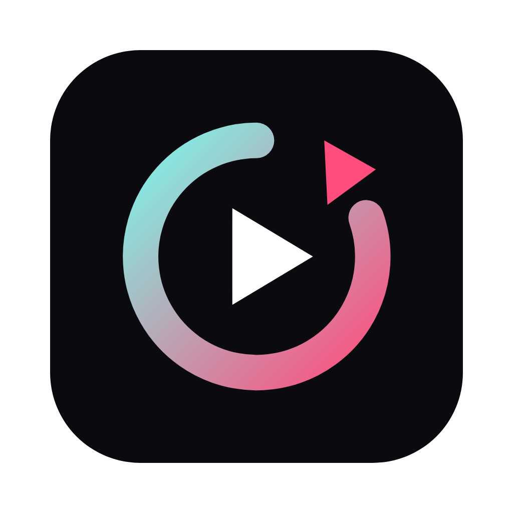
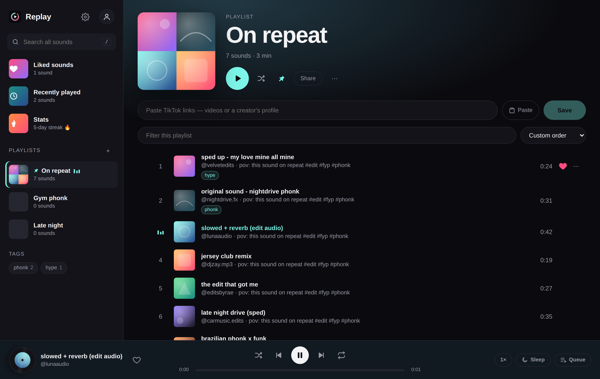
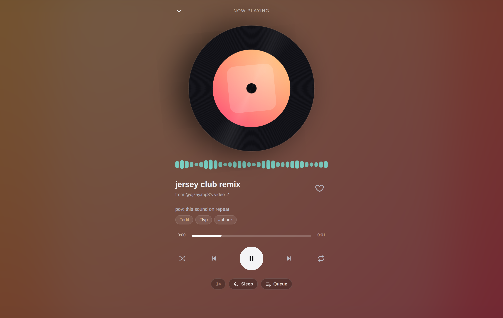
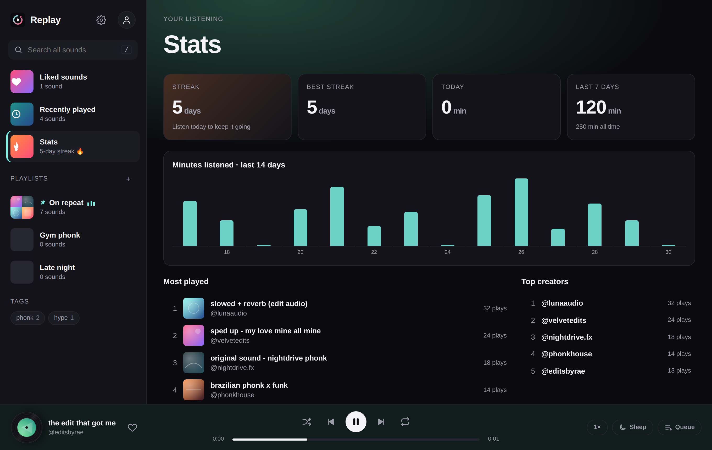
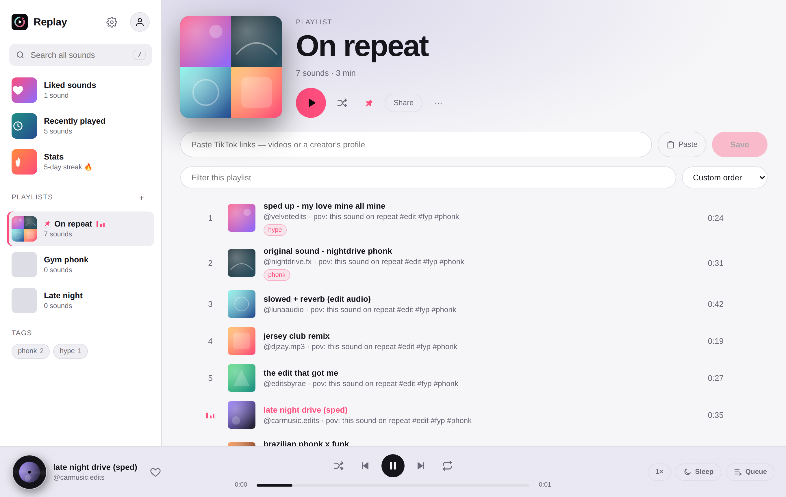
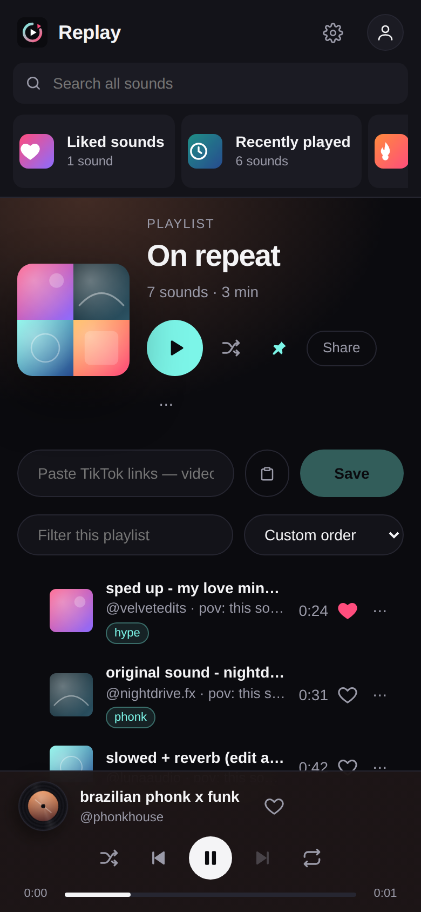

<div align="center">



# Replay

**Your TikTok sounds, in playlists.**
Save the exact sound from any TikTok video (the sped-up edit, the slowed version, the creator's remix) and play it like a music app, with the screen locked or in the background.

[](https://github.com/TheExterminator67/replay/releases/latest)
&nbsp;
[](https://github.com/TheExterminator67/replay/releases/latest)
&nbsp;
[](https://github.com/TheExterminator67/replay/releases/latest)

[**Download**](#-download) · [**Install**](#-install) · [**How to use**](#-how-to-use) · [**Features**](#-features) · [**FAQ**](#-faq) · [**Web version**](https://tokplay-kappa.vercel.app)

<br />



</div>

---

## ✨ Why Replay?

People use TikTok as a music player, but to replay a sound you have to go find the video again, and it stops the moment you leave the app. Replay fixes that:

- 🔗 **Paste a TikTok link → the sound is saved.** It's the exact audio from that video, not the "official" song.
- 🎧 **Plays like Spotify.** Playlists, queue, shuffle, keeps going in the background, and works with your media keys.
- 💾 **Yours.** Your library lives on your device, with optional sign-in to sync it everywhere.

<div align="center">

&nbsp;

</div>

---

## ⬇️ Download

Go to the **[latest release](https://github.com/TheExterminator67/replay/releases/latest)** and pick the file for your computer:

| Your computer | Download this |
|---|---|
| 🍎 **Mac with Apple Silicon** (M1, M2, M3, M4…) | `Replay-x.y.z-mac-arm64.dmg` |
| 🍎 **Mac with Intel** | `Replay-x.y.z-mac-x64.dmg` |
| 🪟 **Windows 10 / 11** | `Replay-Setup-x.y.z.exe` |
| 🪟 Windows, no install (e.g. school PC) | `Replay-x.y.z-portable.exe` |
| 📱 **iPhone / Android** | Use the [web version](https://tokplay-kappa.vercel.app) and *Add to Home Screen* (see below) |

> **Not sure which Mac you have?** Click the  Apple menu → **About This Mac**. If "Chip" says *Apple M…*, get **arm64**. If it says *Intel*, get **x64**.

---

## 🛠 Install

### 🍎 Mac

1. Open the `.dmg` you downloaded.
2. Drag **Replay** into the **Applications** folder.
3. Open Replay from Applications.

**The first time only**, macOS will say Replay "can't be opened" because it isn't from the App Store. To open it anyway:

- Click **Done** on the warning, then open **System Settings → Privacy & Security**, scroll down, and click **Open Anyway** next to Replay. Confirm with your password.

<details>
<summary><b>It says "Replay is damaged and can't be opened"</b></summary>

That's macOS quarantining an unsigned download, not actual damage. Open **Terminal** and run:

```bash
xattr -cr /Applications/Replay.app
```

Then open Replay again.
</details>

### 🪟 Windows

1. Run `Replay-Setup-x.y.z.exe`.
2. If **"Windows protected your PC"** appears, click **More info → Run anyway**. It shows because the app isn't code-signed.
3. Follow the installer. Replay appears in your Start menu and on your desktop.

The **portable** `.exe` doesn't install anything. Just double-click it to run.

### 📱 iPhone & Android

There's no App Store app yet. Use the web version, which works like an app once added to your home screen:

- **iPhone:** open [the web version](https://tokplay-kappa.vercel.app) in **Safari** → **Share** → **Add to Home Screen**.
- **Android:** open it in **Chrome** → **⋮** → **Install app**. Then *Share → Replay* shows up in TikTok's share menu.

### 🔄 Updating

Replay checks for new versions when it starts and tells you when one is out. You can also use **Help → Check for updates…**. Download the new version the same way; your library stays.

---

## 🎵 How to use

### Save a sound

1. In TikTok, open a video whose sound you love → **Share** → **Copy link**.
2. In Replay, click **Paste** (or paste into the bar at the top of a playlist) → **Save**.

That's it: the sound is in your playlist. Other ways to add:

| How | What to do |
|---|---|
| **Many at once** | Paste a bunch of links together (one per line is fine) → **Save N** |
| **Drag & drop** | Drag a TikTok link onto any playlist in the sidebar |
| **A creator's sounds** | Paste their profile link (`tiktok.com/@name`); this works *sometimes*, since TikTok often hides the list |
| **From your iPhone** | Set up the one-time [iPhone share shortcut](https://tokplay-kappa.vercel.app/ios), then in TikTok: **Share → Save to Replay** |

### Play

- Click any sound to play it. Click the **spinning record** at the bottom for the **full-screen player**.
- **Sped up / Slowed:** the `1×` button changes speed *and* pitch, TikTok-style.
- **Queue:** **⋯** on a sound → *Play next* / *Add to queue*. Open the **Queue** button to drag things around.
- **Sleep timer:** stop after 15–60 minutes, or at the end of the current sound.
- It keeps playing when the window is closed (Mac) or minimized, and your keyboard's ⏯ ⏭ ⏮ keys work.

### Organize

- **Playlists:** **+** next to *Playlists*. Hover the cover to **choose a photo**. 📌 pins a playlist to the top.
- **Reorder:** drag the ⋮⋮ handle, or sort by date, title, creator, length or most played.
- **Tags:** **⋯ → Edit tags** (like `hype`, `sleep`, `phonk`). Tags appear in the sidebar as their own lists.
- **Search everything:** press **/** or use the search box.
- **♥ Liked sounds** and **Recently played** fill themselves.
- **Check for unavailable sounds** (⋯ on a playlist) finds TikToks that were deleted.

### Keyboard shortcuts

| Key | Does |
|---|---|
| `Space` | Play / pause |
| `→` `←` | Skip 5 seconds |
| `N` / `P` | Next / previous |
| `L` | Like |
| `S` / `R` | Shuffle / repeat |
| `Q` | Queue |
| `F` | Full-screen player |
| `/` | Search |
| `?` | All shortcuts |

---

## 🌟 Features

<table>
<tr><td>

**Library**
- Playlists with custom photos
- Pin, drag-to-reorder, sort
- Tags / moods
- Search across everything
- Liked & Recently played
- Unavailable-sound checker
- Backup & restore file

</td><td>

**Player**
- Background & lock-screen playback
- Media keys & lock-screen controls
- Queue, shuffle, repeat
- Sped up / Slowed
- Sleep timer
- Full-screen view with visualizer
- Swipe to skip (phone)

</td><td>

**Extras**
- Enhanced audio: volume boost, leveling, bass, reverb
- Dark / Black / Light themes + accent color
- Colors that follow the cover art
- Stats & listening streaks 🔥
- Accounts (Google or email) & sync
- Share playlists with a link
- Works offline once loaded

</td></tr>
</table>

<div align="center">

&nbsp;

</div>

---

## ❓ FAQ

<details>
<summary><b>Do I need an account?</b></summary>

No. Everything works without one, and your library is saved on your computer. Sign in (Google or email, via the 👤 icon) only if you want the same library on your other devices, or to share playlists.
</details>

<details>
<summary><b>Where is my library stored? Is it private?</b></summary>

On your device. If you sign in, a copy syncs to your own private space in the cloud that only your account can read. Replay has no ads and no tracking. **Download backup** (👤 → Backup file) saves everything to a file anytime.
</details>

<details>
<summary><b>A sound won't save or won't play</b></summary>

- Make sure it's a link to a **video**, not to a TikTok *sound page*.
- Private, deleted or region-locked videos can't be saved. Use **⋯ → Check for unavailable sounds** to find them.
- If a sound plays in a small **video** box instead of as audio, TikTok didn't give Replay an audio file for it. It still plays, but may pause in the background.
</details>

<details>
<summary><b>Google sign-in doesn't open in the desktop app</b></summary>

Allow the sign-in popup if asked. If Google says the browser isn't supported, use **email & password** instead (👤 → *Create an account*). Your library syncs the same way.
</details>

<details>
<summary><b>Does it download TikTok's audio?</b></summary>

No. Replay saves the *link* and streams the sound from TikTok when you play it. Nothing is re-uploaded anywhere. Replay isn't affiliated with TikTok, and playing sounds outside TikTok's own app is a grey area in TikTok's terms, so it's meant for personal use.
</details>

---

## 🐞 Feedback & bugs

Found a bug or have an idea? [Open an issue](https://github.com/TheExterminator67/replay/issues/new) with what happened, your computer (Mac/Windows) and the Replay version (Help → Check for updates…).

## 📝 Changelog

See the [releases page](https://github.com/TheExterminator67/replay/releases) for what's new in each version.

---

<div align="center">

Made by **[Sultan Alnuaimi](https://sultanalnuaimi.com)** · [GitHub](https://github.com/TheExterminator67)

<sub>Replay is closed-source and free to use. It is an independent project and is not affiliated with or endorsed by TikTok or ByteDance.</sub>

</div>
